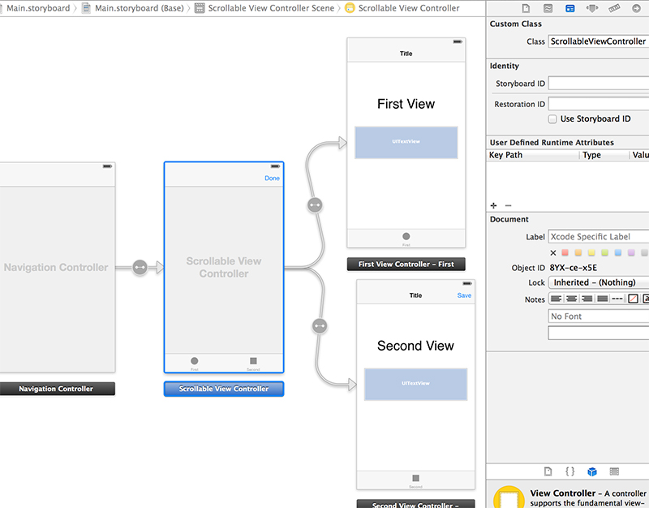

ScrollableViewController
========================

A Twitter.app-like scrollable view controller, subclasses UITabBarController. An animated gif is better than a thousand words.

Installation
--------------

ScrollableViewController can be installed by copying the files inside the *ScrollableViewController* directory.

There is also a *ScrollableViewController.podspec* **podspec file** you can easily add OSSpritz to your project adding this line to your Podfile:

	pod "ScrollableViewController", :podspec => "https://raw.github.com/Fr4ncis/ScrollableViewController/master/ScrollableViewController.podspec"
	
We will soon fully support Cocoapods to provide an even easier method to integrate it in your project.

Getting started
---------------

After integrating ScrollableViewController into your project, using it is as easy as turning a UITabBarController into a ScrollableViewController!

### If you're using nib files / storyboards:
* Make sure you have a UINavigationController with a UITabBarController as a rootviewcontroller.
* In the third panel on the right (Identity Inspector) set the UITabBarController to custom class ScrollableViewController.
* Profit!

### If you want to do things the hardcore way (programmatically):

You instantiate a ScrollableViewController and its children viewcontrollers.

	ScrollableViewController *tabBar = [[ScrollableViewController alloc] init];
    tabBar.viewControllers = @[[ViewController new],[ViewController new],[ViewController new]];
    
You have to set the titles for the viewcontrollers yourself.

    tabBar.titles = @[@"First",@"Second",@"Third"];
    
Embed the ScrollableViewController in a navigation controller.
    
    UINavigationController *navCtrl = [[UINavigationController alloc] initWithRootViewController:tabBar];
    
and don't forget `#import <ScrollableViewController.h>`

Technical details
-----------------

The library has been written using ARC. It can still be used on non-ARC projects by enabling the `-fobj-arc` compiler flag on the *.m files*.

The library supports **iOS 7 only** but it should be straightforward to backport it to iOS5/6.

Contributors
------------

This is an open-source project built during my spare time, feel free to contribute to the project.

Considerations & Donations
--------------------------

This started as an hobby project, to try to implement from scratch something very similar to what Twitter did. My main goal is to learn how to lead an open-source public project, so it's more of a learning experience than anything else. I hope you appreciate the effort ;)

If you want to get some specific features implemented first or you need help to set it up in your own project, [get in touch](mailto:ego@fr4ncis.net).

To speed-up development [donations](https://www.paypal.com/cgi-bin/webscr?cmd=_s-xclick&hosted_button_id=FQPB9PZGVBXL2) are very welcome.
